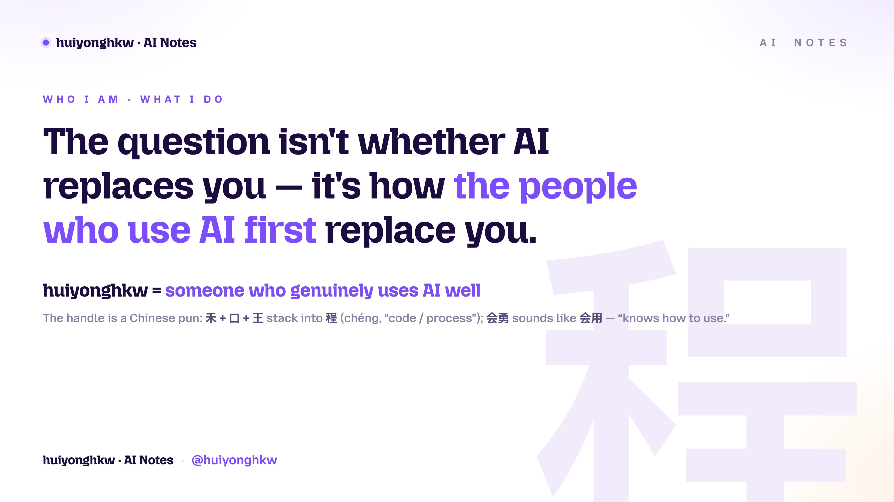

<div align="right"><sub><b>English</b> · <a href="README.zh.md">中文</a></sub></div>

<div align="center">



### The question isn't whether AI will replace you — it's how the people who use AI first will.

`禾口王 → 程`　·　`会勇 → 会用`　·　**someone who genuinely uses AI well**

<a href="https://hekouwang.pages.dev"></a>


</div>

---

## 🧩 About me

I make complicated AI make sense, and help you turn it into real value. Three things, that's it:

- 💡 **Explain it clearly** — break dense AI down into plain talk. No jargon walls, no mysticism.
- 🔍 **Show the value** — I don't just repeat the news. I walk you through how it actually works and where the money is.
- 🎁 **Hand it over** — the methods and Skills I've built up go straight into your hands, so your AI gets the job done too.

My handle is a Chinese pun. The last three characters 「禾口王」 stack into 「程」 (*chéng*, "code / process"); 「会勇」 sounds like 「会用」 ("knows how to use") — so the name reads as **"someone who genuinely knows how to use AI."** I'm a backend veteran of 10+ years (`gitlab-ci-docker` 302★ · `lnmp-docker` 238★), now working full-time on turning AI into real productivity and running my content studio *AI Notes by huiyonghkw*.

## 🧰 Open-source Skills (drop-in for Claude Code)

| Skill | What it does |
|---|---|
| [**hekouwang-claude-md-doctor-skill**](https://github.com/huiyonghkw/hekouwang-claude-md-doctor-skill) | CLAUDE.md linter: scores it as runtime config (0–100) + fix suggestions |
| [**hekouwang-claude-skill-doctor-skill**](https://github.com/huiyonghkw/hekouwang-claude-skill-doctor-skill) | Agent Skill linter: rates SKILL.md triggering / length / progressive disclosure / safety |
| [**hekouwang-yandu-deck-skill**](https://github.com/huiyonghkw/hekouwang-yandu-deck-skill) | Yandu Deck: article → one-screen-per-scene slide deck, self-hosted fonts, ships to Cloudflare Pages |
| [**hekouwang-stock-data-reader-skill**](https://github.com/huiyonghkw/hekouwang-stock-data-reader-skill) | Public stock-data reader: pulls data via akshare → neutral post-hoc recap (financial-compliance guardrails built in) |
| [**hekouwang-cc-prod-skill**](https://github.com/huiyonghkw/hekouwang-cc-prod-skill) | Product-intro animations: wide-screen scroll HTML pipeline + one-click deploy to Aliyun OSS |
| [**cc-passenger-prototype-design-skill**](https://github.com/huiyonghkw/cc-passenger-prototype-design-skill) | Passenger-app UI design system: OKLCH + BEM, pages that speak one visual language |

## 🏷 Toolbox


## 📊 On GitHub

<div align="center">


</div>

### 🧬 Languages I work in

```text
PHP          ██████████████░░░░░░░░░░  60%   main backend · Laravel
Java         ███░░░░░░░░░░░░░░░░░░░░░░  14%   server-side
Go           ██░░░░░░░░░░░░░░░░░░░░░░░  10%   cloud-native · CLI
Python       ██░░░░░░░░░░░░░░░░░░░░░░░   8%   AI · data · automation
JavaScript   █░░░░░░░░░░░░░░░░░░░░░░░░   5%   frontend · Vue
Shell        █░░░░░░░░░░░░░░░░░░░░░░░░   3%   DevOps
```

> Estimated by actual time spent, not GitHub byte counts (the auto-widget gets skewed by old PHP repos).

## 🌐 Find me

- 🏠 Homepage / Yandu Deck: **[hekouwang.pages.dev](https://hekouwang.pages.dev)**
- 📓 Everywhere (CN platforms): WeChat · Xiaohongshu · Toutiao · Bilibili — search **「会勇禾口王的AI笔记」**
- ✉️ huiyonghkw@gmail.com

<div align="center">

<sub>Making AI make sense · so it creates more value for you</sub>

</div>
