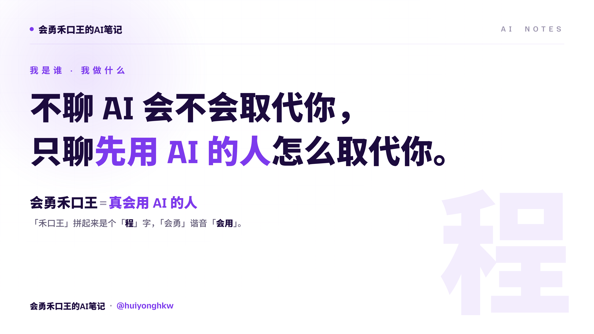

<div align="right"><sub><a href="README.md">English</a> · <b>中文</b></sub></div>

<div align="center">



### 不聊 AI 会不会取代你，只聊先用 AI 的人怎么取代你。

`禾口王 → 程`　·　`会勇 → 会用`　·　**真会用 AI 的程序员**

<a href="https://hekouwang.pages.dev"></a>


</div>

---

## 🧩 关于我

把复杂的 AI 讲明白，帮你把它用成生产力。做的事就三句：

- 💡 **讲明白** —— 复杂 AI 拆成人话，看懂门道和价值
- 🎁 **给得着** —— 我先跑通的方法和 SKILL，直接交到你手上
- 🤝 **带得动** —— 把 AI 用成队友，一个人干出一支团队

「禾口王」拼起来是个「程」字，「会勇」谐音「会用」——**会勇禾口王 = 真会用 AI 的程序员**。十余年后端老兵（`gitlab-ci-docker` 302★ · `lnmp-docker` 238★），正把 AI 用成生产力，经营「会勇禾口王的AI笔记」内容工厂：每套工作流我先跑通，再演给你看。

## 🧰 开源 Skills（Claude Code 拿来即用）

| Skill | 干什么 |
|---|---|
| [**hekouwang-claude-md-doctor-skill**](https://github.com/huiyonghkw/hekouwang-claude-md-doctor-skill) | CLAUDE.md 体检器：把它当运行时配置打分(0–100) + 修复建议 |
| [**hekouwang-claude-skill-doctor-skill**](https://github.com/huiyonghkw/hekouwang-claude-skill-doctor-skill) | Agent Skill 体检器：评 SKILL.md 触发/篇幅/渐进披露/安全 |
| [**hekouwang-yandu-deck-skill**](https://github.com/huiyonghkw/hekouwang-yandu-deck-skill) | 演读 DECK：文章→一屏一镜翻页演示，自托管字体，发 Cloudflare Pages |
| [**hekouwang-stock-data-reader-skill**](https://github.com/huiyonghkw/hekouwang-stock-data-reader-skill) | 个股公开数据速读：akshare 拉数→中立事后复盘（内置金融合规护栏） |

### 🚕 客户项目 · 定制客运 SaaS（成都希格斯 / CC招车）

| Skill | 干什么 |
|---|---|
| [**hekouwang-cc-prod-skill**](https://github.com/huiyonghkw/hekouwang-cc-prod-skill) | 产品介绍动画：宽屏滚动 HTML 生产 + 一键发布到阿里云 OSS |
| [**cc-passenger-prototype-design-skill**](https://github.com/huiyonghkw/cc-passenger-prototype-design-skill) | 乘客端 UI 设计系统：OKLCH + BEM，同源同语产出页面 |

## 🏷 工具箱


## 📊 在 GitHub 上

<div align="center">


</div>

### 🧬 主力语言

```text
PHP          ██████████████░░░░░░░░░░  60%   后端主力 · Laravel
Java         ███░░░░░░░░░░░░░░░░░░░░░░  14%   服务端
Go           ██░░░░░░░░░░░░░░░░░░░░░░░  10%   云原生 · CLI
Python       ██░░░░░░░░░░░░░░░░░░░░░░░   8%   AI · 数据 · 自动化
JavaScript   █░░░░░░░░░░░░░░░░░░░░░░░░   5%   前端 · Vue
Shell        █░░░░░░░░░░░░░░░░░░░░░░░░   3%   DevOps
```

> 按实际投入估算，非 GitHub 仓库字节统计（自动卡会被历史 PHP 仓库带偏）。

## 🌐 找我

- 🏠 主题站 / 演读 DECK：**[hekouwang.pages.dev](https://hekouwang.pages.dev)**
- 📓 全渠道：公众号 · 小红书 · 头条 · B站 —— 搜「**会勇禾口王的AI笔记**」
- ✉️ huiyonghkw@gmail.com

<div align="center">

<sub>把 AI 讲明白 · 让它为你创造更大的价值</sub>

</div>
